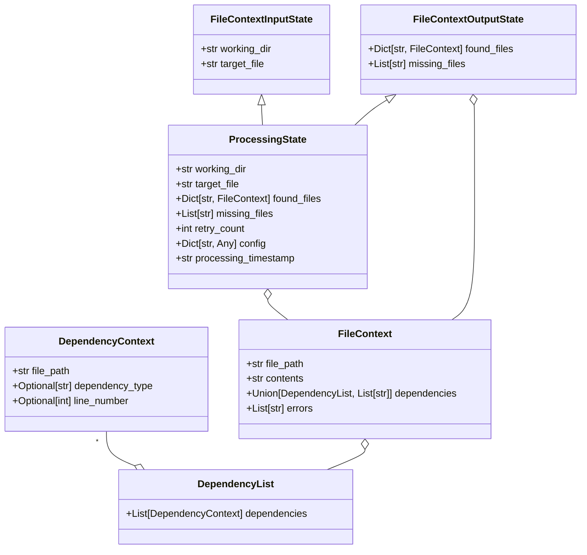

## Data Structure Explanation

### 1. DependencyContext
- Represents a single file dependency
- Contains:
  - `file_path`: Absolute path to the dependent file
  - `dependency_type`: Type of dependency (e.g., import, module)
  - `line_number`: Line number where the dependency is referenced

### 2. DependencyList
- A container for multiple `DependencyContext` objects
- Allows structured validation of dependencies

### 3. FileContext
- Represents the context of a single file
- Contains:
  - `file_path`: Path to the file
  - `contents`: File contents
  - `dependencies`: List of dependencies (either `DependencyList` or simple string list)
  - `errors`: List of any errors encountered

### 4. FileContextInputState
- Initial input state for processing file context
- Contains:
  - `working_dir`: Working directory
  - `target_file`: Target file to process

### 5. FileContextOutputState
- Output state after processing file context
- Contains:
  - `found_files`: Dictionary of processed files
  - `missing_files`: List of files that could not be found

### 6. ProcessingState
- Comprehensive state combining input and output states
- Inherits from `FileContextInputState` and `FileContextOutputState`
- Additional fields:
  - `retry_count`: Number of processing retries
  - `config`: Configuration dictionary
  - `processing_timestamp`: Timestamp of processing

The diagram shows the relationships between these classes, highlighting the nested and inherited nature of the data structure.
