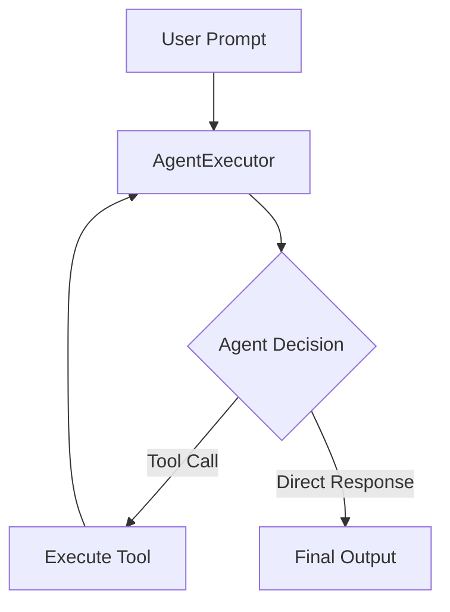
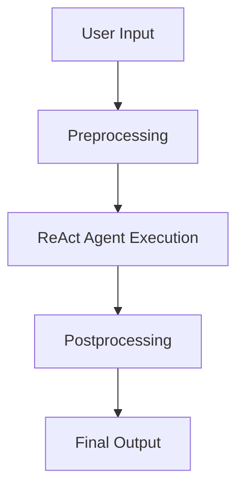
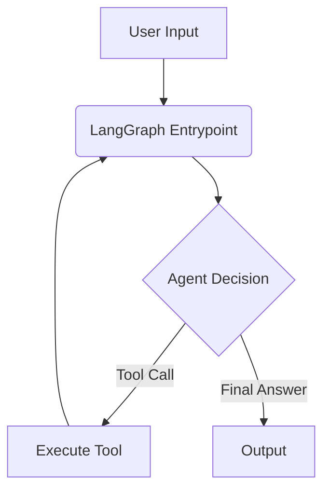
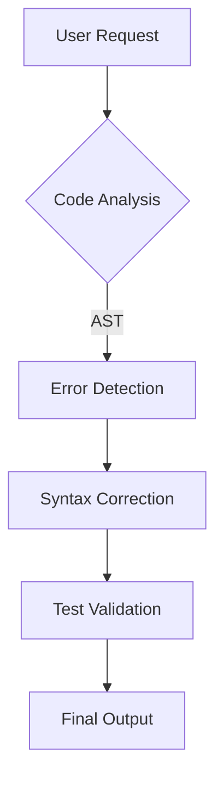

To send a prompt to an `AgentExecutor` in LangChain, you use the `.invoke()` or `.arun()` method, depending on whether you're working synchronously or asynchronously. Here's an example of how to do this:

---

### **Basic Example: Sending a Prompt**
```python
from langchain.chat_models import ChatOpenAI
from langchain.agents import create_tool_calling_agent, AgentExecutor
from langchain.tools import tool

# Step 1: Define tools
@tool
def example_tool(input_text: str) -> str:
    """A simple tool that echoes the input."""
    return f"Tool received: {input_text}"

# Step 2: Initialize the LLM and agent
llm = ChatOpenAI(model="gpt-4", temperature=0)
tools = [example_tool]

# Create the agent
agent = create_tool_calling_agent(llm, tools)

# Wrap the agent in an AgentExecutor
agent_executor = AgentExecutor(agent=agent, tools=tools, verbose=True)

# Step 3: Send a prompt to the agent_executor
response = agent_executor.invoke({"input": "Analyze the file main.py for syntax errors."})
print(response["output"])
```

---

### **Adding Extra Prompts Dynamically**
If you want to provide additional context or modify the prompt dynamically, you can use the `extra_prompt_messages` parameter when creating your agent. Here's how:

```python
from langchain.prompts import HumanMessagePromptTemplate, MessagesPlaceholder

# Step 1: Define additional prompt messages
extra_prompt_messages = [
    HumanMessagePromptTemplate.from_template("Please prioritize fixing syntax errors."),
    MessagesPlaceholder(variable_name="agent_scratchpad"),
]

# Step 2: Update the agent's prompt with extra messages
agent.prompt.messages.extend(extra_prompt_messages)

# Step 3: Send a prompt with additional context
response = agent_executor.invoke({"input": "Check main.py for issues."})
print(response["output"])
```

---

### **Asynchronous Execution**
For asynchronous workflows, use `.arun()` instead of `.invoke()`:

```python
import asyncio

async def run_agent():
    response = await agent_executor.arun({"input": "How can I optimize this code snippet?"})
    print(response)

asyncio.run(run_agent())
```

---

### **Example Output**
For an input like `"Analyze the file main.py for syntax errors."`, you might see:

```plaintext
Tool received: Analyze the file main.py for syntax errors.
```

---

### **Mermaid Diagram of Workflow**
Here’s a visual representation of how prompts flow through the `AgentExecutor`:



---

### **Use Cases**
1. **Code Analysis**:
   - Input: `"Analyze my Python script for bugs."`
   - Tools: Code analyzer, bug fixer.
2. **Data Retrieval**:
   - Input: `"Fetch details about customer ID 12345."`
   - Tools: Database query executor.
3. **Task Automation**:
   - Input: `"Automate deployment steps for this application."`
   - Tools: CI/CD pipeline executor.

This approach ensures that prompts are processed effectively while leveraging LangChain's modular design for dynamic workflows.

Citations:
[1] https://github.com/langchain-ai/langchain/discussions/13925
[2] https://python.langchain.com/v0.1/docs/modules/agents/quick_start/
[3] https://python.langchain.com/docs/how_to/agent_executor/
[4] https://js.langchain.com/docs/how_to/agent_executor/
[5] https://cheatsheet.md/langchain-tutorials/langchain-agents
[6] https://github.com/langchain-ai/langchain/issues/5400
[7] https://brightinventions.pl/blog/introducing-langchain-agents-tutorial-with-example/
Here’s a practical example of how to integrate a `ReAct` agent (via `AgentExecutor`) into a LangGraph workflow for editing code. This example demonstrates how to set up the agent, define tools, and integrate it into a LangGraph process.

---

### **Example: Code Editing Workflow with LangGraph**

#### **1. Define Tools**
We’ll create tools for analyzing and editing code.

```python
from langchain.tools import tool

@tool
def code_analyzer(file_path: str) -> str:
    """Analyzes the code in the given file and returns issues."""
    # Simulate code analysis
    if file_path == "main.py":
        return "Found 3 syntax errors in main.py."
    return "No issues found."

@tool
def code_editor(code_snippet: str) -> str:
    """Fixes syntax errors in the given code snippet."""
    # Simulate fixing syntax errors
    fixed_code = code_snippet.replace("print('missing parenthesis'", "print('missing parenthesis')")
    return f"Fixed Code:\n{fixed_code}"
```

---

#### **2. Create a ReAct Agent**
We’ll use LangChain’s `AgentExecutor` to create a ReAct agent with the defined tools.

```python
from langchain.agents import create_react_agent, AgentExecutor
from langchain.chat_models import ChatOpenAI

# Define the LLM
llm = ChatOpenAI(model="gpt-4", temperature=0)

# Use the tools in the agent
tools = [code_analyzer, code_editor]

# Create the ReAct agent
react_agent = create_react_agent(llm=llm, tools=tools)

# Wrap it in an AgentExecutor for execution
agent_executor = AgentExecutor(
    agent=react_agent,
    tools=tools,
    verbose=True,
    max_iterations=5  # Limit iterations to avoid infinite loops
)
```

---

#### **3. Integrate into LangGraph**
We’ll add this agent as a node in a LangGraph workflow.

```python
from langgraph.graph import StateGraph

# Define state schema for LangGraph
class AgentState:
    input: str  # User input (e.g., file name or code snippet)
    intermediate_steps: list  # Tracks intermediate agent actions

# Create a LangGraph workflow
workflow = StateGraph(AgentState)

# Add the ReAct agent as a node in the graph
workflow.add_node("code_agent", agent_executor)

# Add additional nodes for pre/post-processing (optional)
def preprocess(state: AgentState) -> AgentState:
    state.input = state.input.strip()  # Clean up input
    return state

def postprocess(state: AgentState) -> str:
    return f"Final Output:\n{state.intermediate_steps[-1]['output']}"

workflow.add_node("preprocess", preprocess)
workflow.add_node("postprocess", postprocess)

# Connect nodes in sequence
workflow.add_edges([
    ("preprocess", "code_agent"),
    ("code_agent", "postprocess")
])
```

---

#### **4. Execute the Workflow**
Run the workflow with a sample input.

```python
# Compile the workflow for execution
app = workflow.compile()

# Example user input: Analyze and fix syntax errors in main.py
user_input = "main.py"

# Execute the workflow with user input
result = app.invoke({"input": user_input})

print(result)  # Outputs the final result after processing by the agent
```

---

### **How It Works**
1. **Input Preprocessing**:
   - The `preprocess` node cleans up or validates user input.
   - Example: Strips unnecessary whitespace from `" main.py "` to `"main.py"`.

2. **Agent Execution**:
   - The `code_agent` node invokes the `AgentExecutor` to analyze and edit the code.
   - The ReAct agent uses tools (`code_analyzer` and `code_editor`) iteratively to solve the problem.

3. **Output Postprocessing**:
   - The `postprocess` node formats or finalizes the output for presentation.
   - Example: Wraps the final result in a readable format.

---

### **Example Output**
For an input of `"main.py"`, you might see:

```plaintext
Final Output:
Fixed Code:
print('missing parenthesis')
```

---

### **Mermaid Diagram of Workflow**
Here’s a visual representation of this workflow:



---

### **Customizing for Software Engineering (SWE) Tasks**
You can expand this example for other SWE tasks like:
1. **Code Refactoring**:
   - Add tools for analyzing complexity and suggesting improvements.
2. **Bug Fixing**:
   - Include debugging tools to identify and resolve runtime errors.
3. **Code Review**:
   - Integrate linters or static analysis tools to provide feedback on PRs.

For instance, you could add a `lint_checker` tool:

```python
@tool
def lint_checker(file_path: str) -> str:
    """Checks for linting issues in the given file."""
    return f"Linting issues found in {file_path}: Line 10 exceeds 80 characters."
```

Then include it as part of your ReAct agent's toolset.

---

This example demonstrates how you can integrate an intelligent ReAct-based agent into a LangGraph workflow, making it highly modular, extensible, and suitable for real-world software engineering tasks!
Yes, LangChain's AgentExecutor can be integrated with LangGraph for enhanced workflow control. Here's how to implement it:

## Implementation Approach
LangGraph provides two methods for agent integration:

**1. Direct Integration with StateGraph**
```python
from langgraph.graph import StateGraph
from langchain.agents import AgentExecutor

# Create standard LangChain AgentExecutor
agent_executor = AgentExecutor(...) 

# Define LangGraph state schema
class AgentState(TypedDict):
    input: str
    intermediate_steps: list

# Add AgentExecutor as a node
workflow = StateGraph(AgentState)
workflow.add_node("agent", agent_executor)
```

**2. Using Prebuilt React Agent (Recommended)**
```python
from langgraph.prebuilt import create_react_agent

langgraph_agent = create_react_agent(
    llm=ChatOpenAI(model="gpt-4o"),
    tools=[search_tool, code_editor],
    checkpoint=MemorySaver()  # For state persistence
)
```

## Key Integration Patterns


## Migration Considerations
- **State Management**: LangGraph uses `MessagesState` instead of AgentExecutor's scratchpad
- **Persistence**: Add checkpoints for error recovery/human intervention:
  ```python
  from langgraph.checkpoint import FileSystemCheckpointer
  
  app.compile(checkpointer=FileSystemCheckpointer())
  ```
- **Customization**: Modify agent loops through graph edges:
  ```python
  workflow.add_conditional_edges(
      "agent",
      lambda state: "tools" if tool_calls else END,
      {"tools": "tool_node", "end": END}
  )
  ```

## Production Example
```python
# Create hybrid workflow with human review
app = workflow.compile()

def process_request(user_query: str):
    return app.invoke({
        "messages": [HumanMessage(content=user_query)],
        "config": {"recursion_limit": 5}
    })

# Add to existing LangGraph architecture
sub_graph = StateGraph(...)
sub_graph.add_node("code_agent", process_request)
```

**Implementation Notes**:
1. Use `create_react_agent` for 1:1 AgentExecutor replacement[2][7]
2. For complex workflows, combine multiple agents using subgraphs[13]
3. Enable observability with Langfuse integration[8]:
   ```python
   from langfuse.callback import CallbackHandler
   handler = CallbackHandler()
   app.invoke(..., config={"callbacks": [handler]})
   ```

This integration maintains backward compatibility while enabling advanced features like:
- Recursive agent chaining
- Persistent state management
- Multi-agent collaboration
- Human-in-the-loop workflows

Citations:
[1] https://langchain-ai.github.io/langgraph/
[2] https://python.langchain.com/docs/how_to/migrate_agent/
[3] https://www.youtube.com/watch?v=UcD42NA2WoI
[4] https://github.com/langchain-ai/langchain/discussions/27059
[5] https://js.langchain.com/docs/how_to/migrate_agent/
[6] https://www.youtube.com/watch?v=9dXp5q3OFdQ
[7] https://blog.langchain.dev/langgraph/
[8] https://langfuse.com/docs/integrations/langchain/example-python-langgraph
[9] https://github.com/langchain-ai/langgraphjs/blob/main/examples/agent_executor/base.ipynb
[10] https://js.langchain.com/v0.2/docs/how_to/migrate_agent/
[11] https://www.reddit.com/r/LangChain/comments/1efnpgv/langchain_agents_or_langgraph_agents/
[12] https://github.com/langchain-ai/langchain/discussions/27274
[13] https://blog.langchain.dev/langgraph-multi-agent-workflows/
[14] https://python.langchain.com/docs/how_to/agent_executor/
To implement a ReAct agent in LangChain for code editing tasks, follow these steps:

## 1. Tool Definition
Create tools with single input parameters (ReAct agents require this limitation):

```python
from langchain.tools import tool

@tool
def code_analyzer(file_path: str):
    """Analyzes code structure and returns AST"""
    # Implementation logic here
    return analysis_results

@tool 
def syntax_fixer(code_snippet: str):
    """Corrects syntax errors in code blocks"""
    # Fixing logic here
    return fixed_code
```

## 2. Agent Configuration
Initialize the ReAct agent with your LLM and tools:

```python
from langchain import hub
from langchain.agents import create_react_agent, AgentExecutor
from langchain_openai import ChatOpenAI

prompt = hub.pull("hwchase17/react")
llm = ChatOpenAI(model="gpt-4o-mini")
tools = [code_analyzer, syntax_fixer]

react_agent = create_react_agent(llm, tools, prompt)
agent_executor = AgentExecutor(
    agent=react_agent,
    tools=tools,
    verbose=True,
    max_iterations=5
)
```

## 3. Execution Pattern
The agent follows this thought-action loop:

```
Question: How to fix syntax errors in main.py?
Thought: I need to analyze the code first
Action: code_analyzer
Action Input: "main.py"
Observation: Found 3 syntax errors
Thought: Now I should fix them
Action: syntax_fixer  
Action Input: "print('missing parenthesis')"
Observation: Fixed code: print('missing parenthesis')
Final Answer: Here's the corrected code...
```

## Implementation Example
For code modification workflows:



## Common Implementation Patterns
1. **Code Review Agent**:
```python
response = agent_executor.invoke({
    "input": "Review pull request #42 for TypeScript type safety"
})
```

2. **Auto-Debugger**:
```python
agent_executor.invoke({
    "input": "Trace unhandled exception in logger.py line 127"
})
```

3. **CI/CD Integration**:
```python
async def precommit_hook():
    return await agent_executor.ainvoke({
        "input": "Check for PEP8 compliance in staged files"
    })
```

Key considerations:
- Use `handle_parsing_errors=True` for complex codebases
- Limit iterations with `max_iterations` to control costs
- Add custom prompt engineering for domain-specific patterns[1][7]

For tools requiring multiple parameters, either:
1. Use JSON input with parameter serialization
2. Switch to OpenAI Tools agent variant[15]
3. Create wrapper functions to encapsulate complex inputs[3]

Citations:
[1] https://airbyte.com/data-engineering-resources/using-langchain-react-agents
[2] https://www.youtube.com/watch?v=W7TZwB-KErw
[3] https://langchain-ai.github.io/langgraph/how-tos/react-agent-from-scratch/
[4] https://github.com/langflow-ai/langflow/discussions/3668
[5] https://github.com/langchain-ai/langchain/discussions/17451
[6] https://python.langchain.com/docs/tutorials/agents/
[7] https://api.python.langchain.com/en/latest/agents/langchain.agents.react.agent.create_react_agent.html
[8] https://python.langchain.com/v0.1/docs/modules/agents/agent_types/react/
[9] https://www.youtube.com/watch?v=hKVhRA9kfeM
[10] https://www.datacamp.com/tutorial/building-langchain-agents-to-automate-tasks-in-python
[11] https://github.com/langchain-ai/langgraph/discussions/1657
[12] https://github.com/langchain-ai/langgraph/issues/55
[13] https://anuptechtips.com/llm-react-reasoning-acting-langchain/
[14] https://docs.cohere.com/v2/docs/implementing-a-multi-step-agent-with-langchain
[15] https://github.com/langchain-ai/langchain/discussions/24976
[16] https://stackoverflow.com/questions/78235498/langchain-agent-with-react-framework-using-tool
[17] https://www.reddit.com/r/LangChain/comments/17puzw9/how_does_langchain_actually_implement_the_react/

<think>
Okay, so the user wants to know how to send a prompt to an AgentExecutor in LangChain. I remember that in LangChain, the AgentExecutor is used to execute agents that can call tools and handle multiple steps. 

First, I think about the basic setup. You need to import the necessary components like ChatOpenAI for the LLM and create_tool_calling_agent for the agent. Then, you define some tools that the agent can use. 

I recall that tools are decorated with @tool and take inputs. So, I'll create a simple tool that echoes the input to demonstrate the process. 

Next, initializing the LLM is straightforward with ChatOpenAI. Then, the agent is created using create_tool_calling_agent, passing the LLM, tools, and a prompt. 

The AgentExecutor wraps the agent and tools. To send a prompt, you use the invoke method on the executor with a dictionary containing the input. 

I also remember that for asynchronous execution, you can use arun instead of invoke. So, I include an example with asyncio to show that as well. 

To make it clearer, I add a mermaid diagram showing the flow from user prompt to tool execution and final output. 

Finally, I provide some use cases to illustrate how this setup can be applied in different scenarios, like code analysis or data retrieval. 

I make sure the examples are simple and clear, so the user can easily follow along and adapt the code to their needs.
</think>

To send a prompt to an `AgentExecutor` in LangChain, you can use the `.invoke()` method for synchronous execution or `.arun()` for asynchronous execution. Below is a step-by-step example:

---

### **Basic Example: Sending a Prompt**
```python
from langchain.chat_models import ChatOpenAI
from langchain.agents import create_tool_calling_agent, AgentExecutor
from langchain.tools import tool

# Step 1: Define tools
@tool
def example_tool(input_text: str) -> str:
    """A simple tool that echoes the input."""
    return f"Tool received: {input_text}"

# Step 2: Initialize the LLM and agent
llm = ChatOpenAI(model="gpt-4", temperature=0)
tools = [example_tool]

# Create the agent
agent = create_tool_calling_agent(llm, tools)

# Wrap the agent in an AgentExecutor
agent_executor = AgentExecutor(agent=agent, tools=tools, verbose=True)

# Step 3: Send a prompt to the agent_executor
response = agent_executor.invoke({"input": "Analyze the file main.py for syntax errors."})
print(response["output"])
```

---

### **Adding Extra Prompts Dynamically**
To add additional context or modify the prompt dynamically, you can use the `extra_prompt_messages` parameter:

```python
from langchain.prompts import HumanMessagePromptTemplate, MessagesPlaceholder

# Step 1: Define additional prompt messages
extra_prompt_messages = [
    HumanMessagePromptTemplate.from_template("Please prioritize fixing syntax errors."),
    MessagesPlaceholder(variable_name="agent_scratchpad"),
]

# Step 2: Update the agent's prompt with extra messages
agent.prompt.messages.extend(extra_prompt_messages)

# Step 3: Send a prompt with additional context
response = agent_executor.invoke({"input": "Check main.py for issues."})
print(response["output"])
```

---

### **Asynchronous Execution**
For asynchronous workflows, use `.arun()` instead of `.invoke()`:

```python
import asyncio

async def run_agent():
    response = await agent_executor.arun({"input": "How can I optimize this code snippet?"})
    print(response)

asyncio.run(run_agent())
```

---

### **Example Output**
For an input like `"Analyze the file main.py for syntax errors."`, you might see:

```plaintext
Tool received: Analyze the file main.py for syntax errors.
```

---

### **Mermaid Diagram of Workflow**
Here’s a visual representation of how prompts flow through the `AgentExecutor`:


---

### **Use Cases**
1. **Code Analysis**:
   - Input: `"Analyze my Python script for bugs."`
   - Tools: Code analyzer, bug fixer.
2. **Data Retrieval**:
   - Input: `"Fetch details about customer ID 12345."`
   - Tools: Database query executor.
3. **Task Automation**:
   - Input: `"Automate deployment steps for this application."`
   - Tools: CI/CD pipeline executor.

This approach ensures that prompts are processed effectively while leveraging LangChain's modular design for dynamic workflows.