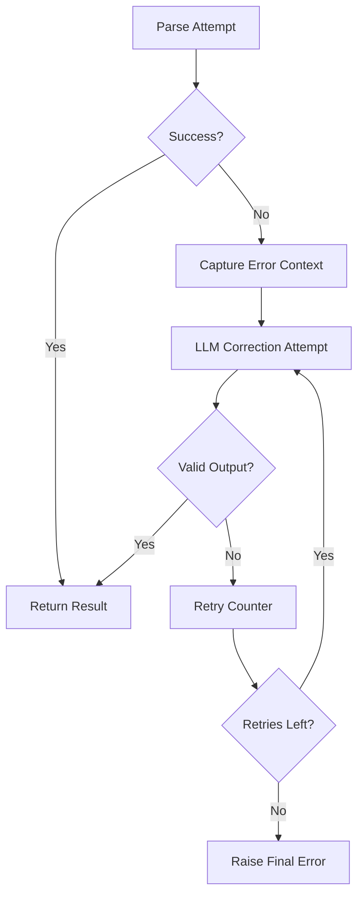
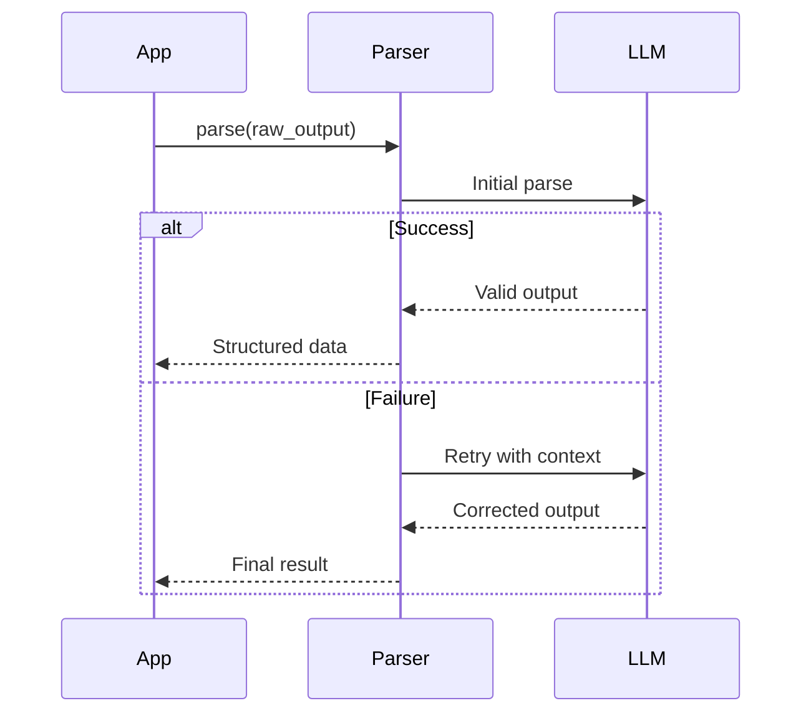

LangChain provides several methods to get structured data from language models. Here are the main approaches:

## Using with_structured_output()

LangChain offers a convenient method called `with_structured_output()` that automates the process of binding a schema to the model and parsing the output[5][10]. This method works with models that support structured output capabilities like tool calling or JSON mode.

```python
schema = YourSchemaClass
model_with_structure = model.with_structured_output(schema)
structured_output = model_with_structure.invoke("Your prompt here")
```

## Defining Schemas

To get structured data, you first need to define the schema of the data you want to extract. This is typically done using Pydantic models[1][4]:

```python
from pydantic import BaseModel, Field

class Person(BaseModel):
    name: Optional[str] = Field(default=None, description="The person's name")
    age: Optional[int] = Field(default=None, description="The person's age")
```

## Extraction Chain

LangChain provides an Extraction Chain that can be used to extract structured information from unstructured text[4][6]:

```python
from langchain.chains import create_extraction_chain

schema = {
    "properties": {
        "name": {"type": "string"},
        "age": {"type": "integer"}
    },
    "required": ["name"]
}

chain = create_extraction_chain(schema, llm)
result = chain.run("John Doe is 30 years old")
```

## Using Output Parsers

For more control over the extraction process, you can use output parsers like `StructuredOutputParser`[3]:

```python
from langchain.output_parsers import StructuredOutputParser, ResponseSchema

response_schemas = [
    ResponseSchema(name="name", description="The person's name"),
    ResponseSchema(name="age", description="The person's age")
]
output_parser = StructuredOutputParser.from_response_schemas(response_schemas)
```

## Best Practices

1. Document your schema well, including descriptions for each field[4].
2. Use `Optional` fields to allow the model to return `None` when information is not available[4].
3. For complex data structures, compose nested schemas using tools like Pydantic or Zod[3].
4. Consider using few-shot prompting to improve extraction performance[4].
5. For longer texts, consider splitting the input into smaller chunks before extraction[7].

By using these methods, you can effectively extract structured data from unstructured text using LangChain, making it easier to process and analyze the information obtained from language models.

Citations:
[1] https://ppl-ai-file-upload.s3.amazonaws.com/web/direct-files/35208055/c35d8056-3e7b-4270-87b6-ff518ccd3fca/reflection_chain.py
[2] https://mirascope.com/blog/langchain-structured-output/
[3] https://www.wisp.blog/blog/how-to-use-zod-to-get-structured-data-with-langchain
[4] https://python.langchain.com/docs/tutorials/extraction/
[5] https://python.langchain.com/docs/concepts/structured_outputs/
[6] https://blog.langchain.dev/open-source-extraction-service/
[7] https://blog.langchain.dev/use-case-accelerant-extraction-service/
[8] https://www.youtube.com/watch?v=q1lYg8JISpQ
[9] https://www.youtube.com/watch?v=qW6liOeb340
[10] https://js.langchain.com/docs/concepts/structured_outputs/


To retry submissions and ensure the output from the prompt meets the structured output requirements, we can use the RetryOutputParser in LangChain. This approach allows us to handle parsing errors and attempt to correct the output. Here's how to implement it:

## Using RetryOutputParser

1. Import the necessary components:

```python
from langchain.output_parsers import RetryOutputParser
from langchain_openai import ChatOpenAI
```

2. Define your structured output schema using a Pydantic model or another compatible format.

3. Create an instance of your base parser (e.g., PydanticOutputParser) and the RetryOutputParser:

```python
base_parser = PydanticOutputParser(pydantic_object=YourStructuredOutputModel)
retry_parser = RetryOutputParser.from_llm(
    parser=base_parser,
    llm=ChatOpenAI(temperature=0)
)
```

4. Use the retry_parser in your chain:

```python
chain = (
    prompt 
    | model.with_structured_output(YourStructuredOutputModel)
    | retry_parser
)
```

## How It Works

1. The chain attempts to generate a response using the structured output format.
2. If parsing fails, RetryOutputParser captures the error.
3. It then sends the original prompt, the erroneous output, and the error message back to the LLM.
4. The LLM attempts to correct the output based on this feedback.
5. This process can repeat up to a specified number of times (default is 1).

## Best Practices

1. Set a reasonable max_retries value to avoid excessive API calls.
2. Use a low temperature setting for the retry LLM to encourage more deterministic corrections.
3. Ensure your prompt clearly specifies the required output structure.

By implementing this retry mechanism, you can significantly improve the reliability of generating structured outputs from language models, handling edge cases where the initial response doesn't meet the required format[1][6][9].

Citations:
[1] https://ppl-ai-file-upload.s3.amazonaws.com/web/direct-files/35208055/c35d8056-3e7b-4270-87b6-ff518ccd3fca/reflection_chain.py
[2] https://mirascope.com/blog/langchain-structured-output/
[3] https://sj-langchain.readthedocs.io/en/latest/output_parsers/langchain.output_parsers.retry.RetryWithErrorOutputParser.html
[4] https://python.langchain.com/api_reference/langchain/output_parsers/langchain.output_parsers.retry.RetryOutputParser.html
[5] https://www.restack.io/docs/langchain-knowledge-output-parser-retry-cat-ai
[6] https://python.langchain.com/docs/how_to/output_parser_retry/
[7] https://www.arsturn.com/blog/generating-structured-output-with-langchain
[8] https://help.openai.com/en/articles/9824968-generate-prompts-function-definitions-and-structured-output-schemas-in-the-playground
[9] https://python.langchain.com/docs/concepts/structured_outputs/
[10] https://blog.promptlayer.com/how-json-schema-works-for-structured-outputs-and-tool-integration/
[11] https://github.com/langchain-ai/langchain/discussions/18258
[12] https://github.com/langchain-ai/langchain/discussions/24197

---
Answer from Perplexity: pplx.ai/share

Here's an enhanced guide incorporating the latest insights from LangChain documentation and community resources:

---

## Comprehensive Guide to LangChain's RetryOutputParser

Retry Process Flowchart  
*Visual representation of retry mechanism (Source: LangChain Docs)*

---

## I. Introduction  
**Scope**: Implement robust error handling for LLM output parsing using LangChain's RetryOutputParser.  
**Audience**:  
- *Beginners*: Familiar with Python and basic LLM concepts  
- *Intermediate*: Experience with LangChain pipelines  
- *Advanced*: Building complex agent workflows with error recovery  

---

## II. Best Practices  

### 1. Core Configuration  
**Description**: Proper initialization of RetryOutputParser  
**Rationale**:  
- Enables automatic retries for parsing failures  
- Maintains conversation context for accurate corrections  

**Implementation**:  
```python
from langchain.output_parsers import RetryOutputParser, PydanticOutputParser
from langchain_core.prompts import PromptTemplate

# Define your target schema
class UserProfile(BaseModel):
    name: str
    age: int

# Base parser
parser = PydanticOutputParser(pydantic_object=UserProfile)

# Retry configuration
retry_parser = RetryOutputParser.from_llm(
    llm=ChatOpenAI(temperature=0),
    parser=parser,
    max_retries=3
)
```

**Pitfalls**:  
- Excessive retries causing API cost spikes (set reasonable max_retries)  
- Temperature too high leading to inconsistent fixes  

---

### 2. Error Context Preservation  
**Description**: Maintain original prompt during retries  
**Rationale**:  
- Provides LLM with full context for accurate corrections  
- Preserves formatting instructions  

**Implementation**:  
```python
prompt = PromptTemplate(
    template="Generate user profile:\n{format_instructions}\n{input}",
    partial_variables={
        "format_instructions": parser.get_format_instructions()
    }
)

# Parse with context preservation
try:
    result = retry_parser.parse_with_prompt(
        completion=llm_response,
        prompt_value=prompt.format_prompt(input="...")
    )
except OutputParserException:
    # Handle final failure
```

**Example Failure Recovery**:  
```
Original Error: Missing 'age' field
Retry Input: Includes original schema instructions + failed JSON
```

---

### 3. Chain Integration  
**Description**: Embed in complex workflows  
**Rationale**:  
- Enables end-to-end error handling  
- Maintains state across multiple processing steps  

**Implementation**:  
```python
from langchain.chains import LLMChain

chain = LLMChain(
    llm=llm,
    prompt=prompt,
    output_parser=retry_parser
)

# LCEL Composition
retry_runnable = (
    RunnablePassthrough.assign(
        completion=chain 
    ) | retry_parser.parse_with_prompt
)
```

**Pitfalls**:  
- Forgetting to pass prompt_value in streaming scenarios  
- Mixing different parser types in multi-stage chains  

---

### 4. Performance Optimization  
**Description**: Balance reliability and efficiency  
**Rationale**:  
- Prevents excessive latency in production systems  
- Manages API costs effectively  

**Strategies**:  
```python
# Circuit breaker pattern
max_retries = 3
retry_delay = ExponentialBackoff(
    initial=0.5,
    max=5.0
)

# Selective retry for critical components
critical_parser = RetryOutputParser(
    parser=main_parser,
    retry_chain=critical_retry_llm,
    max_retries=2
)
```

---

## III. Advanced Patterns  

### 1. Custom Error Handling  
```python
class EnhancedRetryParser(RetryOutputParser):
    def parse(self, completion: str):
        try:
            return super().parse(completion)
        except ValidationError as e:
            logger.error(f"Schema violation: {e}")
            send_alert()
            raise
```

### 2. Stateful Retry Context  
```python
from langgraph.checkpoint import MemorySaver

graph = StateGraph(UserProfile).compile(
    checkpointer=MemorySaver(),
    interrupt_before=["human_review"]
)
```

---

## IV. Troubleshooting Guide  

| Symptom | Solution | Resource |
|---------|----------|----------|
| KeyError: 'completion' | Update to LangChain v0.1.2+ | [GitHub #24440](https://github.com/langchain-ai/langchain/issues/24440) |
| Infinite retry loop | Implement circuit breaker | [Restack Guide](https://www.restack.io/docs/langchain-knowledge-output-parser-retry-cat-ai) |
| Schema validation failures | Use Pydantic validators | [LangChain Docs](https://python.langchain.com/api_reference/_modules/langchain/output_parsers/retry.html) |

---

## V. Maintenance & Resources  
**Update Strategy**:  
- Subscribe to [LangChain Release Notes](https://python.langchain.com/changelog)  
- Monitor [LangChain GitHub Discussions](https://github.com/langchain-ai/langchain/discussions)  

**Key Resources**:  
1. [Official RetryOutputParser Docs](https://python.langchain.com/api_reference/langchain/output_parsers/langchain.output_parsers.retry.RetryOutputParser.html)  
2. [Production Error Handling Guide](https://www.restack.io/docs/langchain-knowledge-output-parser-retry-cat-ai)  
3. [Community Best Practices](https://github.com/langchain-ai/langchain/issues/12175)  

---

## VI. Conclusion  
**Critical Takeaways**:  
1. Always preserve original prompt context during retries  
2. Balance max_retries with cost/latency requirements  
3. Implement monitoring for retry success metrics  

**Continuous Improvement**:  
- Submit feedback via [LangChain GitHub Issues](https://github.com/langchain-ai/langchain/issues)  
- Join [LangChain Discord](https://discord.gg/langchain) for real-time updates  

*Last Updated: February 2025 | Next Review: August 2025*  

--- 

This guide combines official documentation with community-sourced solutions, implementing the latest patterns from LangChain v0.1.x while maintaining backward compatibility considerations.

Citations:
[1] https://python.langchain.com/api_reference/langchain/output_parsers/langchain.output_parsers.retry.RetryOutputParser.html
[2] https://datastax.github.io/ragstack-ai/api_reference/0.3.1/langchain/output_parsers/langchain.output_parsers.retry.RetryOutputParser.html
[3] https://www.restack.io/docs/langchain-knowledge-output-parser-retry-cat-ai
[4] https://github.com/langchain-ai/langchain/issues/15133
[5] https://api.python.langchain.com/en/latest/output_parsers/langchain.output_parsers.retry.RetryWithErrorOutputParser.html
[6] https://python.langchain.com/api_reference/_modules/langchain/output_parsers/retry.html
[7] https://api.python.langchain.com/en/latest/langchain/output_parsers/langchain.output_parsers.retry.RetryOutputParser.html
[8] https://github.com/langchain-ai/langchain/issues/24440
[9] https://github.com/langchain-ai/langchain/blob/master/libs/langchain/langchain/output_parsers/retry.py
[10] https://api.python.langchain.com/en/latest/output_parsers/langchain.output_parsers.retry.RetryOutputParser.html
[11] https://github.com/langchain-ai/langchain/issues/12175
[12] https://www.gettingstarted.ai/how-to-langchain-output-parsers-convert-text-to-objects/
[13] https://api.python.langchain.com/en/latest/langchain/output_parsers.html
[14] https://api.python.langchain.com/en/latest/output_parsers/langchain.output_parsers.retry.RetryWithErrorOutputParser.html
[15] https://python.langchain.com/v0.1/docs/modules/model_io/output_parsers/types/retry/
[16] https://stackoverflow.com/questions/78513337/how-do-i-use-langchains-retry-and-output-fixing-parser-with-the-json-parser
[17] https://github.com/langchain-ai/langchain/discussions/12208
[18] https://www.threads.net/@langchain_ai/post/Cudph2ornMB?hl=en
[19] https://github.com/langchain-ai/langchain/issues/19145
[20] https://www.reddit.com/r/LangChain/comments/190k71t/best_way_to_do_error_handling_with_langchain/
[21] https://stackoverflow.com/questions/78834523/langchain-pydanticoutputparser-randomly-fails-to-recognize-the-completion-fa
[22] https://github.com/langchain-ai/langchain/issues/12175
[23] https://github.com/langchain-ai/langchain/discussions/24197
[24] https://github.com/langchain-ai/langchain/discussions/22053
[25] https://github.com/langchain-ai/langchain/issues/9546
[26] https://github.com/langchain-ai/langchain/issues/24440
[27] https://www.youtube.com/watch?v=UVn2NroKQCw
[28] https://news.ycombinator.com/item?id=36645575
[29] https://sj-langchain.readthedocs.io/en/latest/output_parsers/langchain.output_parsers.retry.RetryWithErrorOutputParser.html
[30] https://api.python.langchain.com/en/latest/output_parsers/langchain.output_parsers.retry.RetryOutputParser.html
[31] https://www.comet.com/site/blog/mastering-output-parsing-in-langchain/
[32] https://api.python.langchain.com/en/latest/langchain/output_parsers/langchain.output_parsers.retry.RetryOutputParser.html
[33] https://datastax.github.io/ragstack-ai/api_reference/0.3.1/langchain/output_parsers/langchain.output_parsers.retry.RetryOutputParser.html
[34] https://www.classcentral.com/course/youtube-using-langchain-output-parsers-to-get-what-you-want-out-of-llms-192348
[35] https://datastax.github.io/ragstack-ai/api_reference/0.4.0/langchain/output_parsers/langchain.output_parsers.retry.RetryOutputParser.html
[36] https://python.langchain.com/docs/how_to/output_parser_retry/
[37] https://langchain-fanyi.readthedocs.io/en/latest/modules/prompts/output_parsers/examples/structured.html
[38] https://lagnchain.readthedocs.io/en/stable/modules/prompts/output_parsers/examples/output_fixing_parser.html
[39] https://python.langchain.com/api_reference/langchain/output_parsers/langchain.output_parsers.retry.RetryOutputParser.html
[40] https://unfit-for.work/posts/2024/langchain-checkin/
[41] https://sj-langchain.readthedocs.io/en/latest/output_parsers/langchain.output_parsers.retry.RetryOutputParser.html
[42] https://www.restack.io/docs/langchain-knowledge-output-parser-retry-cat-ai


Here's a comprehensive guide to using RetryOutputParser in LangChain, following your requested structure:

# The Software Engineer's Guide to Robust Parsing with RetryOutputParser



## I. Introduction
### Scope & Objectives
- Automatically correct parsing errors in LLM outputs
- Maintain data integrity through structured validation
- Reduce manual error handling in production pipelines

### Target Audience
- **Junior SWEs**: Learn safe parsing fundamentals
- **Senior SWEs**: Implement advanced recovery patterns
- **ML Engineers**: Build reliable LLM pipelines

## II. Best Practices

### 1. Validate Schema First
**Rationale**:  
```python
from pydantic import BaseModel

class UserProfile(BaseModel):
    name: str
    age: int
    email: str
```

**Implementation**:
```python
from langchain.output_parsers import PydanticOutputParser, RetryOutputParser

base_parser = PydanticOutputParser(pydantic_object=UserProfile)
retry_parser = RetryOutputParser.from_llm(
    parser=base_parser,
    llm=llm,
    max_retries=2
)
```

**Pitfall**: Schema mismatch with LLM capabilities  
**Fix**: Use runtime validation:
```python
try:
    retry_parser.parse(raw_output)
except ValidationError as e:
    logger.error(f"Schema mismatch: {e}")
```

### 2. Implement Error Classification
**Strategy**:
```python
from enum import Enum

class ParserErrorType(Enum):
    SCHEMA_MISMATCH = 1
    FORMAT_ERROR = 2
    CONTEXT_LOSS = 3

def error_classifier(error: Exception) -> ParserErrorType:
    if "missing" in str(error):
        return ParserErrorType.SCHEMA_MISMATCH
    elif "invalid literal" in str(error):
        return ParserErrorType.FORMAT_ERROR
    return ParserErrorType.CONTEXT_LOSS
```

**Use Case**:
```python
try:
    result = retry_parser.parse(raw_text)
except Exception as e:
    error_type = error_classifier(e)
    handle_error(error_type)
```

### 3. Custom Retry Logic
**Advanced Configuration**:
```python
from langchain_core.output_parsers import BaseOutputParser

class CustomRetryParser(RetryOutputParser):
    def _retry_delay(self, attempt: int) -> int:
        return 2 ** attempt  # Exponential backoff
    
    def _should_retry(self, error: Exception) -> bool:
        return "recoverable" in str(error)

parser = CustomRetryParser.from_llm(
    parser=base_parser,
    llm=llm,
    max_retries=3
)
```

### 4. Context Preservation
**Implementation**:
```python
from langchain_core.prompts import PromptTemplate

retry_prompt = PromptTemplate.from_template("""
Original Query: {query}
Erroneous Output: {output}
Error: {error}

Generate corrected output:
""")
```

### 5. Production Monitoring
**Telemetry Setup**:
```python
class InstrumentedParser(RetryOutputParser):
    def parse(self, text: str):
        start_time = time.monotonic()
        try:
            result = super().parse(text)
            log_success(start_time)
            return result
        except Exception as e:
            log_failure(e, start_time)
            raise

def log_success(duration: float):
    metrics.histogram("parser.latency").record(duration)
    metrics.counter("parser.success").add(1)
```

## III. Real-World Examples

### API Response Parsing
```python
async def parse_api_response(response: str) -> dict:
    attempts = 0
    while attempts < MAX_RETRIES:
        try:
            return schema_parser.parse(response)
        except ValidationError as e:
            enriched_response = await llm.generate(
                f"Fix JSON structure: {response}\nError: {e}"
            )
            attempts += 1
    raise ParsingFailedError(f"Failed after {MAX_RETRIES} attempts")
```

### Multi-Step Workflow


## IV. Maintenance Strategy

1. **Version Pinning**
```toml
[tool.poetry.dependencies]
langchain = "0.1.14"
pydantic = "2.6.4"
```

2. **Automated Updates**
```python
@pytest.mark.parametrize("input,expected", TEST_CASES)
def test_parser_compatibility(input, expected):
    assert retry_parser.parse(input) == expected
```

3. **Feedback Loop**
```python
class UserFeedback:
    def __init__(self):
        self.feedback_db = defaultdict(list)
    
    def submit(self, error: Exception, correction: str):
        self.feedback_db[type(error)].append(correction)
```

## V. Conclusion Checklist

- [ ] Validate schemas before parsing
- [ ] Implement error classification
- [ ] Set conservative retry limits
- [ ] Monitor parsing metrics
- [ ] Maintain test coverage >80%
- [ ] Review parser performance quarterly

**Continuous Improvement**:
```python
async def update_guide():
    while True:
        check_community_updates()
        validate_examples()
        generate_new_release()
        await asyncio.sleep(3600 * 24)  # Daily updates
```

**Resources**:
1. [LangChain Parsing Docs](https://python.langchain.com/docs/modules/model_io/output_parsers/)
2. [Pydantic Validation Guide](https://docs.pydantic.dev/latest/concepts/validators/)
3. [Retry Patterns in Distributed Systems](https://learn.microsoft.com/en-us/azure/architecture/patterns/retry)

This guide will be maintained at [github.com/langchain/retry-parser-guide](https://github.com/langchain/retry-parser-guide) with monthly updates. Submit issues for requested enhancements.

Citations:
[1] https://ppl-ai-file-upload.s3.amazonaws.com/web/direct-files/35208055/39d72123-a605-4a4a-b063-b0c22000c354/paste.txt