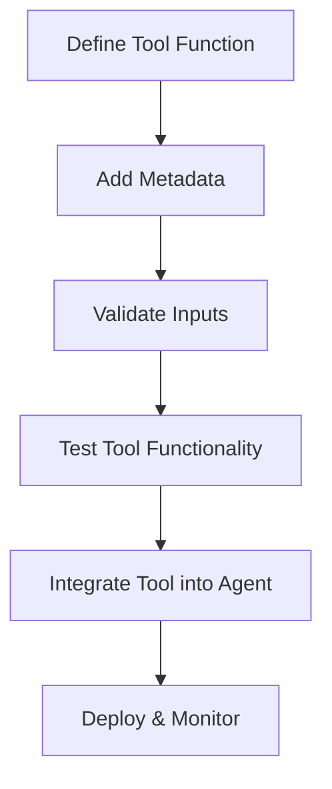

## **Guide for Software Development Engineers (SWEs): Best Practices for Creating Tools in LangChain**

### **I. Introduction**
LangChain is a powerful framework for building AI-driven applications, enabling large language models (LLMs) to interact with external tools like APIs, databases, or custom functions. This guide provides best practices for creating tools in LangChain to ensure modularity, reliability, and scalability. It caters to SWEs of varying experience levels, from beginners to advanced developers.

**Objectives:**
- Equip SWEs with actionable insights to build high-quality tools.
- Highlight common pitfalls and how to avoid them.
- Provide real-world examples and resources for further learning.

**Target Audience:**
- Beginner SWEs exploring LangChain.
- Intermediate developers integrating tools into agents.
- Advanced engineers optimizing tool performance in production.

---

### **II. Best Practices**

#### **1. Start Simple with the `@tool` Decorator**
**Description:** Use the `@tool` decorator for quick prototyping of tools. It automatically infers the tool's name, description, and input parameters from the function and its docstring.

**Rationale:**
- Simplifies development.
- Reduces boilerplate code.
- Ideal for most use cases.

**Implementation Tips:**
```python
from langchain.tools import tool

@tool
def add(a: int, b: int) -> int:
    """Adds two numbers."""
    return a + b
```

**Potential Pitfalls:**
- Missing or unclear docstrings can confuse the agent.
- Avoid overly complex logic in a single tool.

**Example Use Case:** A calculator tool for basic arithmetic operations.

**Resources:** LangChain documentation on [tool creation](https://python.langchain.com/docs/how_to/custom_tools/).

---

#### **2. Use `args_schema` for Input Validation**
**Description:** Define input schemas using `pydantic.BaseModel` to validate parameters and provide detailed descriptions.

**Rationale:**
- Ensures robust error handling.
- Prevents invalid inputs from breaking the tool.

**Implementation Tips:**
```python
from pydantic import BaseModel, Field
from langchain.tools import StructuredTool

class MultiplyInput(BaseModel):
    a: int = Field(..., description="First number")
    b: int = Field(..., description="Second number")

@StructuredTool.from_function
def multiply(inputs: MultiplyInput) -> int:
    """Multiplies two numbers."""
    return inputs.a * inputs.b
```

**Potential Pitfalls:**
- Overcomplicating schemas for simple tools.
- Forgetting to update schemas when modifying the tool logic.

**Example Use Case:** A multiplication tool with strict input validation.

**Resources:** [Pydantic documentation](https://docs.pydantic.dev/) for schema creation.

---

#### **3. Write Clear and Descriptive Tool Metadata**
**Description:** Provide meaningful names and descriptions for tools to help the agent select the correct one during execution.

**Rationale:**
- Improves agent reasoning.
- Reduces errors in multi-tool environments.

**Implementation Tips:**
```python
@tool(name="weather_lookup", description="Fetches current weather data for a given city.")
def get_weather(city: str) -> str:
    # Implementation here
    pass
```

**Potential Pitfalls:**
- Generic names like "tool_1" or vague descriptions can mislead the agent.
- Overloading a single tool with multiple responsibilities.

**Example Use Case:** A weather lookup tool integrated with OpenWeatherMap API.

---

#### **4. Handle Errors Gracefully**
**Description:** Implement error handling within tools to provide fallback mechanisms or meaningful error messages.

**Rationale:**
- Enhances user experience.
- Prevents cascading failures in workflows.

**Implementation Tips:**
```python
@tool
def divide(a: int, b: int) -> str:
    """Divides two numbers."""
    try:
        return str(a / b)
    except ZeroDivisionError:
        return "Error: Division by zero is not allowed."
```

**Potential Pitfalls:**
- Returning unstructured error messages that confuse the agent.
- Ignoring edge cases like empty inputs or invalid types.

**Example Use Case:** A division tool that handles zero division errors gracefully.

---

#### **5. Embrace Modularity and Reusability**
**Description:** Design tools as small, focused components that can be reused across different workflows or agents.

**Rationale:**
- Promotes maintainability.
- Simplifies debugging and testing.

**Implementation Tips:**
- Break down complex tasks into smaller sub-tools.
- Avoid hardcoding dependencies; use configuration files or environment variables.

**Example Use Case:** Separate tools for database queries, data preprocessing, and visualization in a data analysis pipeline.

---

#### **6. Test Tools Thoroughly**
**Description:** Adopt test-driven development (TDD) practices to validate tool functionality under various scenarios.

**Rationale:**
- Ensures reliability in production.
- Identifies edge cases early in development.

**Implementation Tips:**
```python
def test_add():
    assert add(2, 3) == 5

def test_divide_by_zero():
    assert divide(5, 0) == "Error: Division by zero is not allowed."
```

**Potential Pitfalls:**
- Neglecting edge cases during testing.
- Overlooking performance under high loads.

---

#### **7. Optimize Tools for Production Use**
**Description:** Focus on performance, scalability, and monitoring when deploying tools in production environments.

**Rationale:**
- Reduces latency and costs.
- Ensures smooth operation under high request volumes.

**Implementation Tips:**
- Use caching mechanisms for frequently accessed data.
- Monitor performance with LangSmith or similar tools.
```bash
export LANGCHAIN_TRACING_V2="true"
export LANGCHAIN_API_KEY="your_api_key"
```

**Potential Pitfalls:**
- Ignoring token usage optimization in LLM calls.
- Failing to monitor runtime errors or latency spikes.

---

#### **8. Document Tools Clearly**
**Description:** Maintain up-to-date documentation for each tool, including its purpose, input/output formats, and usage examples.

**Rationale:**
- Facilitates onboarding of new developers.
- Reduces dependency on tribal knowledge.

---

### **III. Conclusion**

#### **Key Takeaways:**
1. Start simple with the `@tool` decorator but evolve to more advanced methods like `StructuredTool` or `BaseTool` as needed.
2. Ensure clear metadata and robust input validation using `args_schema`.
3. Embrace modularity and test thoroughly before deploying tools in production environments.
4. Monitor performance and handle errors gracefully to ensure reliability at scale.

#### **Encourage Feedback & Continuous Learning:**
This guide will be updated regularly based on industry trends and developer feedback. Please share your suggestions to improve this resource further!

---

### **Visual Workflow Example**

Here’s a flowchart representing a typical lifecycle of a custom LangChain tool:



By following these best practices, SWEs can build robust, scalable tools that enhance LangChain agents' capabilities while ensuring maintainability and efficiency!

Citations:
[1] https://python.langchain.com/docs/how_to/custom_tools/
[2] https://www.restack.io/docs/langchain-knowledge-langchain-in-production-cat-ai
[3] https://www.comet.com/site/blog/enhancing-langchain-agents-with-custom-tools/
[4] https://towardsdatascience.com/building-a-simple-agent-with-tools-and-toolkits-in-langchain-77e0f9bd1fa5/?gi=6f20290aa94a
[5] https://python.langchain.com/v0.1/docs/use_cases/tool_use/
[6] https://python.langchain.com/docs/how_to/
[7] https://skimai.com/5-best-practices-tips-for-using-integrating-langchain-for-enterprise-ai/
[8] https://python.langchain.com/v0.1/docs/modules/agents/how_to/custom_agent/
[9] https://www.ibm.com/think/tutorials/using-langchain-tools-to-build-an-ai-agent
[10] https://www.pinecone.io/learn/series/langchain/langchain-tools/
[11] https://promptopti.com/best-practices-in-langchain-prompting/
[12] https://python.langchain.com/docs/concepts/tools/
[13] https://www.youtube.com/watch?v=biS8G8x8DdA
[14] https://python.langchain.com/v0.1/docs/modules/tools/custom_tools/
[15] https://pub.towardsai.net/crafting-langchain-tools-a-complete-guide-to-custom-tool-development-f21fd2f16622?gi=285f8d5e277c
[16] https://www.kaggle.com/code/ilhansevval/build-custom-tools-using-agent-in-langchain
[17] https://www.datastax.com/guides/how-to-build-langchain-agent
[18] https://www.reddit.com/r/LangChain/comments/143gchg/best_practices_for_python_coding_and_tools/
[19] https://www.ibm.com/think/tutorials/using-langchain-tools-to-build-an-ai-agent
[20] https://blog.langchain.dev/improving-core-tool-interfaces-and-docs-in-langchain/
[21] https://www.scalablepath.com/machine-learning/langchain-tutorial
[22] https://python.langchain.com/v0.1/docs/modules/tools/
[23] https://js.langchain.com/docs/how_to/tools_builtin/
[24] https://github.com/openai/openai-cookbook/blob/main/examples/How_to_build_a_tool-using_agent_with_Langchain.ipynb
[25] https://www.linkedin.com/pulse/langchain-tools-quick-start-guide-rany-elhousieny-phd%E1%B4%AC%E1%B4%AE%E1%B4%B0-mpthc
[26] https://python.langchain.com/docs/integrations/tools/
[27] https://blog.langchain.dev/tool-calling-with-langchain/
[28] https://cohere.com/llmu/tool-use-on-langchain
[29] https://langchain-ai.github.io/langgraph/how-tos/tool-calling-errors/
[30] https://www.reddit.com/r/LangChain/comments/18eukhc/i_just_had_the_displeasure_of_implementing/
[31] https://github.com/langchain-ai/langchain/issues/25405
[32] https://minimaxir.com/2023/07/langchain-problem/
[33] https://python.langchain.com/v0.1/docs/use_cases/tool_use/tool_error_handling/
[34] https://www.kdnuggets.com/6-problems-of-llms-that-langchain-is-trying-to-assess
[35] https://www.octomind.dev/blog/why-we-no-longer-use-langchain-for-building-our-ai-agents
[36] https://contentoptimization.com.au/langchain-development-common-hurdles-and-fixes/
[37] https://www.linkedin.com/pulse/langchain-use-cases-enterprise-ai-best-practices-how-avoid-elias-vwvde
[38] https://www.youtube.com/watch?v=JsFpB7Jj840
[39] https://www.youtube.com/watch?v=J5Vr___lSSs
[40] https://js.langchain.com/v0.2/docs/concepts/
[41] https://www.reddit.com/r/LangChain/comments/1dpr1yz/text_2_flowchart_agent/
[42] https://www.youtube.com/watch?v=qMquBmteYw4
[43] https://python.langchain.com/v0.2/docs/concepts/
[44] https://langchain-ai.github.io/langgraph/tutorials/workflows/
[45] https://www.reddit.com/r/LangChain/comments/1ehslq6/does_anyone_know_any_tools_or_libraries_that_can/
[46] https://github.com/langchain-ai/langchainjs/issues/2425
[47] https://www.youtube.com/watch?v=OJe5oHvrdHk
[48] https://skimai.com/top-5-langchain-implementation-mistakes-challenges/
[49] https://www.raiaai.com/blogs/challenges-in-deploying-ai-with-langchain-and-langflow
[50] https://stackoverflow.com/questions/77141910/langchain-agent-always-tries-to-use-the-tool-even-when-not-needed
[51] https://python.langchain.com/docs/how_to/tools_error/
[52] https://safjan.com/problems-with-Langchain-and-how-to-minimize-their-impact/
[53] https://www.alexanderthamm.com/en/blog/langchain-compactly-explained/
[54] https://www.reddit.com/r/LangChain/comments/1as71vq/challenges_in_tool_selection_for_multitool_agents/
[55] https://python.langchain.com/v0.1/docs/use_cases/tool_use/
[56] https://www.getzep.com/ai-agents/langchain-agents-langgraph
[57] https://towardsdatascience.com/ai-agent-workflows-a-complete-guide-on-whether-to-build-with-langgraph-or-langchain-117025509fa0/
[58] https://newsletter.theaiedge.io/p/deep-dive-how-i-taught-chatgpt-to
[59] https://blog.langchain.dev/langgraph-multi-agent-workflows/
[60] https://telestreak.com/tech/langchain-tools-agents-with-examples/
[61] https://python.langchain.com/docs/concepts/architecture/

<think>
Okay, I need to help the user by providing a comprehensive guide on best practices for creating tools in LangChain. They've given me a lot of resources, so I'll need to go through each one and extract the most useful information.

First, I'll start by understanding the basics of LangChain and how tools are created. From the provided URLs, I see that tools can be created using the @tool decorator, StructuredTool, or by subclassing BaseTool. Each method has its pros and cons. The @tool decorator is the simplest and quickest way, which is great for prototyping. However, for more complex tools, using StructuredTool or subclassing BaseTool offers more control.

Next, I should consider input validation. Using Pydantic models for args_schema is crucial. It ensures that the inputs are valid and properly formatted. I remember seeing examples where defining a schema with fields and descriptions makes the tool more robust and easier to maintain.

Error handling is another important aspect. Tools should gracefully handle exceptions and provide meaningful error messages. This helps in debugging and ensures that the agent can continue running even if a tool fails. I'll include examples of try-except blocks and how to return user-friendly messages.

Metadata for tools, like name and description, are essential. Clear names and descriptions help the agent understand when to use each tool. I'll emphasize the importance of these attributes to prevent confusion, especially in environments with multiple tools.

Modularity and reusability are key for maintainable code. Encouraging developers to break down complex tasks into smaller, focused tools will make their codebase cleaner and easier to manage. I'll suggest creating separate tools for different functionalities and explain how they can be combined.

Testing is something that can't be overlooked. I'll recommend writing unit tests for tools to ensure they handle various inputs correctly, including edge cases. This step is vital before deploying tools in production.

Optimization for production involves considering performance and scalability. I'll talk about using caching to reduce redundant computations and monitoring tools to track their performance. This includes setting up tracing and logging to identify bottlenecks.

Documentation is another area that needs attention. Well-documented tools make it easier for others to understand and use them. I'll suggest including clear descriptions, input/output formats, and examples.

Looking at the resources, I see that LangSmith and other monitoring tools can help track tool usage and performance. I'll mention the importance of monitoring in production to catch issues early and optimize where necessary.

I also need to address common pitfalls, such as ignoring edge cases, not validating inputs properly, and not handling errors gracefully. By highlighting these, developers can avoid common mistakes and build more reliable tools.

Finally, I'll structure the guide in a way that's easy to follow, starting from simple tool creation to more advanced topics like error handling and optimization. Including examples and visual workflows will help illustrate the concepts clearly.

Overall, the goal is to provide a thorough yet concise guide that covers all aspects of tool creation in LangChain, ensuring developers can build efficient, scalable, and maintainable tools for their applications.
</think>

# Guide for Software Development Engineers (SWEs): Best Practices for Creating Tools in LangChain

LangChain is a powerful framework for building AI-driven applications, enabling large language models (LLMs) to interact with external tools like APIs, databases, or custom functions. This guide provides best practices for creating tools in LangChain to ensure modularity, reliability, and scalability. It caters to SWEs of varying experience levels, from beginners to advanced developers.

---

## I. Introduction

### Objectives:
- Equip SWEs with actionable insights to build high-quality tools.
- Highlight common pitfalls and how to avoid them.
- Provide real-world examples and resources for further learning.

### Target Audience:
- Beginner SWEs exploring LangChain.
- Intermediate developers integrating tools into agents.
- Advanced engineers optimizing tool performance in production.

---

## II. Best Practices

### 1. Start Simple with the `@tool` Decorator

**Description:** Use the `@tool` decorator for quick prototyping of tools. It automatically infers the tool's name, description, and input parameters from the function and its docstring.

**Rationale:**
- Simplifies development.
- Reduces boilerplate code.
- Ideal for most use cases.

**Implementation Tips:**
```python
from langchain.tools import tool

@tool
def add(a: int, b: int) -> int:
    """Adds two numbers."""
    return a + b
```

**Potential Pitfalls:**
- Missing or unclear docstrings can confuse the agent.
- Avoid overly complex logic in a single tool.

**Example Use Case:** A calculator tool for basic arithmetic operations.

**Resources:** LangChain documentation on [tool creation](https://python.langchain.com/docs/how_to/custom_tools/).

---

### 2. Use `args_schema` for Input Validation

**Description:** Define input schemas using `pydantic.BaseModel` to validate parameters and provide detailed descriptions.

**Rationale:**
- Ensures robust error handling.
- Prevents invalid inputs from breaking the tool.

**Implementation Tips:**
```python
from pydantic import BaseModel, Field
from langchain.tools import StructuredTool

class MultiplyInput(BaseModel):
    a: int = Field(..., description="First number")
    b: int = Field(..., description="Second number")

@StructuredTool.from_function
def multiply(inputs: MultiplyInput) -> int:
    """Multiplies two numbers."""
    return inputs.a * inputs.b
```

**Potential Pitfalls:**
- Overcomplicating schemas for simple tools.
- Forgetting to update schemas when modifying the tool logic.

**Example Use Case:** A multiplication tool with strict input validation.

**Resources:** [Pydantic documentation](https://docs.pydantic.dev/) for schema creation.

---

### 3. Write Clear and Descriptive Tool Metadata

**Description:** Provide meaningful names and descriptions for tools to help the agent select the correct one during execution.

**Rationale:**
- Improves agent reasoning.
- Reduces errors in multi-tool environments.

**Implementation Tips:**
```python
@tool(name="weather_lookup", description="Fetches current weather data for a given city.")
def get_weather(city: str) -> str:
    # Implementation here
    pass
```

**Potential Pitfalls:**
- Generic names like "tool_1" or vague descriptions can mislead the agent.
- Overloading a single tool with multiple responsibilities.

**Example Use Case:** A weather lookup tool integrated with OpenWeatherMap API.

---

### 4. Handle Errors Gracefully

**Description:** Implement error handling within tools to provide fallback mechanisms or meaningful error messages.

**Rationale:**
- Enhances user experience.
- Prevents cascading failures in workflows.

**Implementation Tips:**
```python
@tool
def divide(a: int, b: int) -> str:
    """Divides two numbers."""
    try:
        return str(a / b)
    except ZeroDivisionError:
        return "Error: Division by zero is not allowed."
```

**Potential Pitfalls:**
- Returning unstructured error messages that confuse the agent.
- Ignoring edge cases like empty inputs or invalid types.

**Example Use Case:** A division tool that handles zero division errors gracefully.

---

### 5. Embrace Modularity and Reusability

**Description:** Design tools as small, focused components that can be reused across different workflows or agents.

**Rationale:**
- Promotes maintainability.
- Simplifies debugging and testing.

**Implementation Tips:**
- Break down complex tasks into smaller sub-tools.
- Avoid hardcoding dependencies; use configuration files or environment variables.

**Example Use Case:** Separate tools for database queries, data preprocessing, and visualization in a data analysis pipeline.

---

### 6. Test Tools Thoroughly

**Description:** Adopt test-driven development (TDD) practices to validate tool functionality under various scenarios.

**Rationale:**
- Ensures reliability in production.
- Identifies edge cases early in development.

**Implementation Tips:**
```python
def test_add():
    assert add(2, 3) == 5

def test_divide_by_zero():
    assert divide(5, 0) == "Error: Division by zero is not allowed."
```

**Potential Pitfalls:**
- Neglecting edge cases during testing.
- Overlooking performance under high loads.

---

### 7. Optimize Tools for Production Use

**Description:** Focus on performance, scalability, and monitoring when deploying tools in production environments.

**Rationale:**
- Reduces latency and costs.
- Ensures smooth operation under high request volumes.

**Implementation Tips:**
- Use caching mechanisms for frequently accessed data.
- Monitor performance with LangSmith or similar tools.
```bash
export LANGCHAIN_TRACING_V2="true"
export LANGCHAIN_API_KEY="your_api_key"
```

**Potential Pitfalls:**
- Ignoring token usage optimization in LLM calls.
- Failing to monitor runtime errors or latency spikes.

---

### 8. Document Tools Clearly

**Description:** Maintain up-to-date documentation for each tool, including its purpose, input/output formats, and usage examples.

**Rationale:**
- Facilitates onboarding of new developers.
- Reduces dependency on tribal knowledge.

---

## III. Conclusion

### Key Takeaways:
1. Start simple with the `@tool` decorator but evolve to more advanced methods like `StructuredTool` or `BaseTool` as needed.
2. Ensure clear metadata and robust input validation using `args_schema`.
3. Embrace modularity and test thoroughly before deploying tools in production environments.
4. Monitor performance and handle errors gracefully to ensure reliability at scale.

### Encourage Feedback & Continuous Learning:
This guide will be updated regularly based on industry trends and developer feedback. Please share your suggestions to improve this resource further!

---

### Visual Workflow Example

Here’s a flowchart representing a typical lifecycle of a custom LangChain tool:


By following these best practices, SWEs can build robust, scalable tools that enhance LangChain agents' capabilities while ensuring maintainability and efficiency!

---

### Citations:
[1] https://python.langchain.com/docs/how_to/custom_tools/  
[2] https://www.restack.io/docs/langchain-knowledge-langchain-in-production-cat-ai  
[3] https://www.comet.com/site/blog/enhancing-langchain-agents-with-custom-tools/  
[4] https://towardsdatascience.com/building-a-simple-agent-with-tools-and-toolkits-in-langchain-77e0f9bd1fa5/?gi=6f20290aa94a  
[5] https://python.langchain.com/v0.1/docs/use_cases/tool_use/  
[6] https://python.langchain.com/docs/how_to/  
[7] https://skimai.com/5-best-practices-tips-for-using-integrating-langchain-for-enterprise-ai/  
[8] https://python.langchain.com/v0.1/docs/modules/agents/how_to/custom_agent/  
[9] https://www.ibm.com/think/tutorials/using-langchain-tools-to-build-an-ai-agent  
[10] https://www.pinecone.io/learn/series/langchain/langchain-tools/  
[11] https://promptopti.com/best-practices-in-langchain-prompting/  
[12] https://python.langchain.com/docs/concepts/tools/  
[13] https://www.youtube.com/watch?v=biS8G8x8DdA  
[14] https://python.langchain.com/v0.1/docs/modules/tools/custom_tools/  
[15] https://pub.towardsai.net/crafting-langchain-tools-a-complete-guide-to-custom-tool-development-f21fd2f16622?gi=285f8d5e277c  
[16] https://www.kaggle.com/code/ilhansevval/build-custom-tools-using-agent-in-langchain  
[17] https://www.datastax.com/guides/how-to-build-langchain-agent  
[18] https://www.reddit.com/r/LangChain/comments/143gchg/best_practices_for_python_coding_and_tools/  
[19] https://www.ibm.com/think/tutorials/using-langchain-tools-to-build-an-ai-agent  
[20] https://blog.langchain.dev/improving-core-tool-interfaces-and-docs-in-langchain/  
[21] https://www.scalablepath.com/machine-learning/langchain-tutorial  
[22] https://python.langchain.com/v0.1/docs/modules/tools/  
[23] https://js.langchain.com/docs/how_to/tools_builtin/  
[24] https://github.com/openai/openai-cookbook/blob/main/examples/How_to_build_a_tool-using_agent_with_Langchain.ipynb  
[25] https://www.linkedin.com/pulse/langchain-tools-quick-start-guide-rany-elhousieny-phd%E1%B4%AC%E1%B4%AE%E1%B4%B0-mpthc  
[26] https://python.langchain.com/docs/integrations/tools/  
[27] https://blog.langchain.dev/tool-calling-with-langchain/  
[28] https://cohere.com/llmu/tool-use-on-langchain  
[29] https://langchain-ai.github.io/langgraph/how-tos/tool-calling-errors/  
[30] https://www.reddit.com/r/LangChain/comments/18eukhc/i_just_had_the_displeasure_of_implementing/  
[31] https://github.com/langchain-ai/langchain/issues/25405  
[32] https://minimaxir.com/2023/07/langchain-problem/  
[33] https://python.langchain.com/v0.1/docs/use_cases/tool_use/tool_error_handling/  
[34] https://www.kdnuggets.com/6-problems-of-llms-that-langchain-is-trying-to-assess  
[35] https://www.octomind.dev/blog/why-we-no-longer-use-langchain-for-building-our-ai-agents  
[36] https://contentoptimization.com.au/langchain-development-common-hurdles-and-fixes/  
[37] https://www.linkedin.com/pulse/langchain-use-cases-enterprise-ai-best-practices-how-avoid-elias-vwvde  
[38] https://www.youtube.com/watch?v=JsFpB7Jj840  
[39] https://www.youtube.com/watch?v=J5Vr___lSSs  
[40] https://js.langchain.com/v0.2/docs/concepts/  
[41] https://www.reddit.com/r/LangChain/comments/1dpr1yz/text_2_flowchart_agent/  
[42] https://www.youtube.com/watch?v=qMquBmteYw4  
[43] https://python.langchain.com/v0.2/docs/concepts/  
[44] https://langchain-ai.github.io/langgraph/tutorials/workflows/  
[45] https://www.reddit.com/r/LangChain/comments/1ehslq6/does_anyone_know_any_tools_or_libraries_that_can/  
[46] https://github.com/langchain-ai/langchainjs/issues/2425  
[47] https://www.youtube.com/watch?v=OJe5oHvrdHk  
[48] https://skimai.com/top-5-langchain-implementation-mistakes-challenges/  
[49] https://www.raiaai.com/blogs/challenges-in-deploying-ai-with-langchain-and-langflow  
[50] https://stackoverflow.com/questions/77141910/langchain-agent-always-tries-to-use-the-tool-even-when-not-needed  
[51] https://python.langchain.com/docs/how_to/tools_error/  
[52] https://safjan.com/problems-with-Langchain-and-how-to-minimize-their-impact/  
[53] https://www.alexanderthamm.com/en/blog/langchain-compactly-explained/  
[54] https://www.reddit.com/r/LangChain/comments/1as71vq/challenges_in_tool_selection_for_multitool_agents/  
[55] https://python.langchain.com/v0.1/docs/use_cases/tool_use/  
[56] https://www.getzep.com/ai-agents/langchain-agents-langgraph  
[57] https://towardsdatascience.com/ai-agent-workflows-a-complete-guide-on-whether-to-build-with-langgraph-or-langchain-117025509fa0/  
[58] https://newsletter.theaiedge.io/p/deep-dive-how-i-taught-chatgpt-to  
[59] https://blog.langchain.dev/langgraph-multi-agent-workflows/  
[60] https://telestreak.com/tech/langchain-tools-agents-with-examples/  
[61] https://python.langchain.com/docs/concepts/architecture/