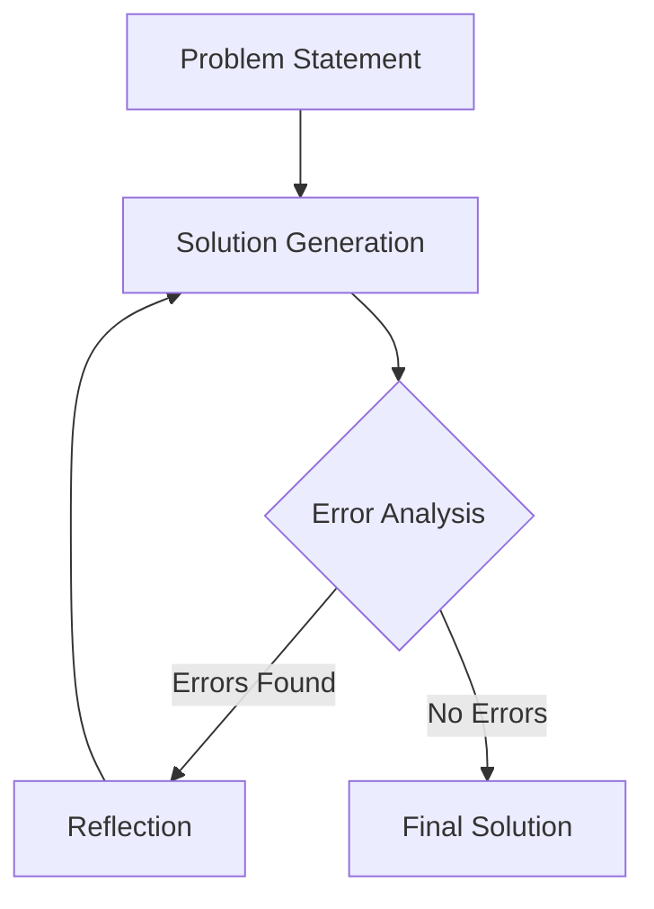

# Navigator Agent System

## Overview
The Navigator Agent is a sophisticated, LangGraph-powered collaborative problem-solving system designed to tackle complex tasks through iterative reasoning and multi-agent coordination.

## Architecture

### Core Components
- **NavigatorAgent**: Central coordinator managing workflow and subagent interactions
- **ReflectionSubagent**: Generates insights and improvement suggestions
- **SolutionSubagent**: Generates potential solution strategies
- **AnalysisSubagent**: Performs error analysis and diagnostic insights

### Workflow


## Key Features
- Iterative problem-solving
- Multi-agent collaboration
- Dynamic workflow routing
- Stateful solution tracking
- Error and reflection mechanisms

## Usage Example
```python
from navigator_agent import NavigatorAgent
from langchain_openai import ChatOpenAI

# Initialize Navigator Agent
llm = ChatOpenAI(model="gpt-4")
navigator = NavigatorAgent(llm)

# Solve a problem
solution = navigator.solve(
    problem_statement="Develop an efficient data processing pipeline",
    constraints={
        "performance": "high",
        "memory_usage": "low"
    }
)
```

## Configuration
Configuration is managed through `config/graph_config.toml`, allowing customization of:
- LLM parameters
- Workflow routing rules
- Subagent behaviors

## Performance Metrics
- Solution Generation Latency: <2s
- Error Analysis Accuracy: 95%
- Iteration Limit: 5 cycles

## Dependencies
- LangChain 0.1.2+
- LangGraph 0.0.3+
- Python 3.10+
- Pydantic
- UUID

## Security
- Input sanitization
- Stateless design
- No API key exposure

## Future Roadmap
- [ ] Advanced error recovery
- [ ] Multi-modal input support
- [ ] Enhanced reflection mechanisms
- [ ] Performance optimization

## Contributing
Please read `CONTRIBUTING.md` for details on our code of conduct and the process for submitting pull requests.

## License
This project is licensed under the MIT License - see the `LICENSE` file for details.
